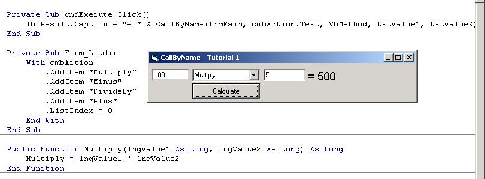



## CallByName \- Calling Methods/Properties by their name

### Description

CallByName can be used to call poperties/methods by their name (string).

This article will learn you how to correctly use the "CallByName" function, using two example programs. It will show how you can Get and Let properties, and how to call methods.

Great for scripting languages!
 
### More Info
 

             |
---                |---
**Submitted On**   |2001-01-27 13:24:58
**By**             |[Almar Joling](https://github.com/Planet-Source-Code/PSCIndex/blob/master/ByAuthor/almar-joling.md)
**Level**          |Intermediate
**User Rating**    |4.9 (103 globes from 21 users)
**Compatibility**  |VB 6\.0
**Category**       |[VB function enhancement](https://github.com/Planet-Source-Code/PSCIndex/blob/master/ByCategory/vb-function-enhancement__1-25.md)
**World**          |[Visual Basic](https://github.com/Planet-Source-Code/PSCIndex/blob/master/ByWorld/visual-basic.md)
**Archive File**   |[CODE\_UPLOAD142191272001\.zip](https://github.com/Planet-Source-Code/almar-joling-callbyname-calling-methods-properties-by-their-name__1-14759/archive/master.zip)

### Source Code

Introduction:
When I was browsing PSC some time ago, I found a scripting language.
Somebody commented on it that it was using many "If...Then...End if" structures to process all the commands.
Well there's an alternative to this in VB6 (only!), and it will give you less work, and increases your programs overall speed!
This alternative is called... <B>CallByName</B>

<B>CallByName</B> allows programmers to call any function, sub or property by the name of it.
I'm going to demostrate this with a small, and easy understandable math program. This math program will be very simple, but it will effectively show you how to use <B>CallByName</B>. I've attached the source code as a zip file, so you can easily see how to use <B>CallByName</B> without having to build the enitre sample app from this tutorial!
This tutorial shows how you can call a method(Function/Sub) and how to change a property.
<H2>Tutorial 1 - Methods</H2>
Okay let's get started. In this program we are going to use the following controls:

 2 Text boxes: Named txtValue1 and txtValue2 
 1 Combo box: Named cmbAction 
 1 Label: Named lblResult 
 1 command button: Named cmdExecute

I've named the form "frmMain". This is standard for all my projects. it isn't really necassary for this project though.
The placement of the controls does not really matter.
Okay double click on the form so that you get the code window, and add the following:

<code>Public Sub Form_Load() 

  With cmbAction 
      .AddItem "Multiply" 
      .AddItem "Minus" 
      .AddItem "DivideBy" 
      .AddItem "Plus" 
      .ListIndex = 0 
 
   End With 
End Sub</code>

The items added to the combobox are the "mathematical actions" we're going to use in our sample application.
<CODE>Listindex = 0</CODE> only sets the first item as an active item.

Now, we have to make our command button "cmdExecute" do something. So, add the following code:

<CODE>
Private SubcmdExecute_Click() 
  lblResult.Caption = CallByName(frmMain, cmbAction.Text, VbMethod, txtValue1, txtValue2) 
End Sub

</CODE>
This is the important part, especially for this tutorial. That's why I'm going to explain it very detailed. 
The syntax of <B>CallByName</B> is as following:

<DL>
<DT><CODE>Function CallByName(Object As Object, ProcName As String, CallType As VbCallType, Args() As Variant)
</CODE></DT>
<DD>
 <CODE>Object as Object</CODE>: This is the object that contains the property/procedure you're calling by name. 
	 So if you want to use the "Left" property of a command button, the object should be the command button. 
	 If it's a procedure in a form, you need to put the form name here.

 <CODE>ProcName As String</CODE>: When calling <B>CallByName</B> you have to specify the property/procedure you're going 	to call or modify, in this sub.  So if you want to call the "Left" property of a command button, you need to put 	"Left" here.

 <CODE>CallType as VbCallType</CODE>: Specify's the type of thing you're calling. A Property(VbLet,VbGet,VbSet) or a 	procedure(VbMethod).  In this example we are going to use VbMethod, because we are going to call functions.

 <CODE>Args() As Variant</CODE>: This is not a real array, like you might think. You just have to put all the values you 	want to use after each other (with "," as separator). They have to match the Method/Property you're calling!  In our example we are going to use functions which need to values. txtValue1 and txtValue2.  Now if you're going to change a property "Left" of a command button, you just specify one new value, which is going to be the new "Left" value.
</DD>
</DL>

I hope you all understand this. It looks complex the first time, but with some code, you're going to find this very easy! 
We're now going to put our mathematical code into the program.  It's very simple math. 
I'm not all too good in Math, but the main point is that you understand how to use <B>CallByName</B>

Add the following code: 
Public Function Multiply(lngValue1 As Long, lngValue2 As Long) As Long 
   Multiply = lngValue1 * lngValue2 
End Function

Public Function Minus(lngValue1 As Long, lngValue2 As Long) As Long 
   Minus = lngValue1 - lngValue2 
End Function

Public Function DivideBy(lngValue1 As Long, lngValue2 As Long) As Long 
   DivideBy = lngValue1 / lngValue2 
End Function

Public Function Plus(lngValue1 As Long, lngValue2 As Long)As Long 
   Plus = lngValue1 + lngValue2 
End Function

Well, those functions should be self explaining. They require two values, and then they do the action represented by the Function's name. 
Got everything ready? Okay run the program [F5]. 
Enter a number in both textboxes. Very high numbers will probably cause an "Overflow", so don't enter malicious numbers :o)

Now, when you press the command button the action you have chosen in the combo box will be executed! 
Only by using the name of the Procedure, and the <B>CallByName</B> method.

<H2>Tutorial 2 - Properties</H2>
<B>CallByName</B> can also be used for setting and retrieving properties. I'll show you how you do that. The source code is also available in the zipfile I earlier mentioned.

The sample application will change the caption of the form (Let), enable/disable a timer (Get/Let), and move a command button around the form. 
In this tutorial, we need the following controls: 
1 Form: Named FrmMain. ScaleMode = VbPixel (3)! 
2 Command buttons: Named cmdChangeCaption and cmdEnableTimer 
1 Timer: Named tmrMove. Interval = 100 
Placement does not really matter.

We are going to change the Form's caption first. Add the following code to the command button named "cmdChangeCaption":

<CODE>Private Sub cmdChangeCaption_Click() 
   CallByName frmMain, "Caption", VbLet, "CallByName - Tutorial 2" 
End Sub</CODE>

So what does this code do? Well, when you click on the command button, it will change the caption of the form to "CallByName - Tutorial 2".  VbLet means that you set the property of an object.

Now where are going to add some code that might look complex, but in fact it really isn't. 
Add the following code to cmdEnableTimer:

<CODE>Private Sub cmdEnableTimer_Click() 
   CallByName tmrMove, "Enabled", VbLet, Not CallByName(tmrMove, "Enabled", VbGet) 
End Sub</CODE>

This code sets the property "Enabled" of the timer. The code is made very efficient, because when you press again it will set the propery to the inverse of the current state.  True-False-True-False, and so on... It retrieves the property using <B>CallByName</B> using "VbGet".

At the moment, the timer does nothing. So let's change that. Add the following code to "tmrMove":

<CODE>Private Sub tmrMove_Timer() 
   CallByName cmdEnableTimer, "Left", VbLet, CInt(Rnd(frmMain.ScaleWidth)) * 100 
   CallByName cmdEnableTimer, "Top", VbLet, CInt(Rnd(frmMain.ScaleHeight)) * 100 
End Sub</CODE>

This code will put the command button on random places (in your form), after you press "Enable Timer". 
If you click again on the button. (Or press enter when it has the focus) the Timer will disable.  Pressing it again will enable it, and so forth...

I hope you enjoyed my first tutorial! If there are any comments please do not hesitate to write them down!

Cheers, 
Almar Joling 
<A HREF="mailto:ajoling@quadrantwars.com">ajoling@quadrantwars.com</A> 
<A HREF="http://www.quadrantwars.com">http://www.quadrantwars.com</A> 
(Completed on 27/01/2001)

